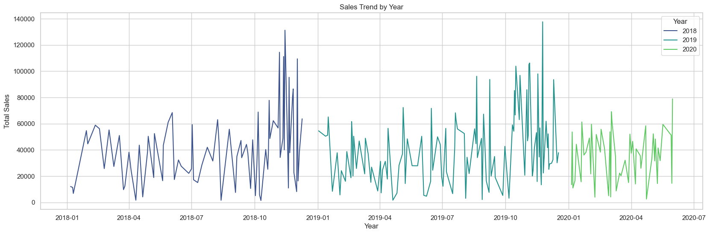
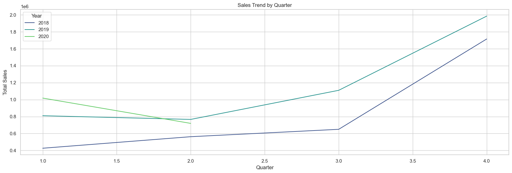
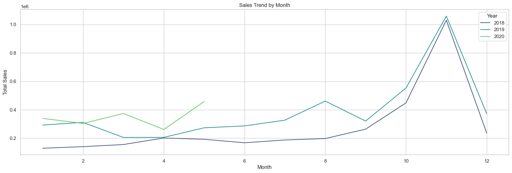
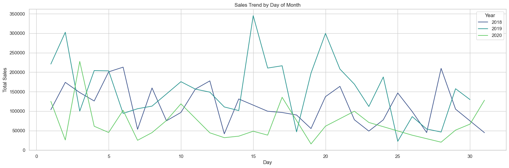
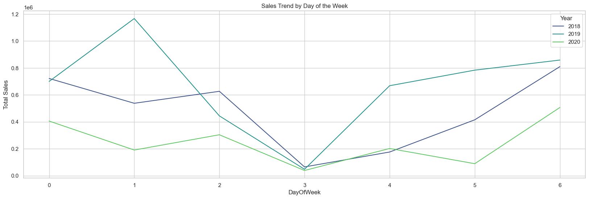
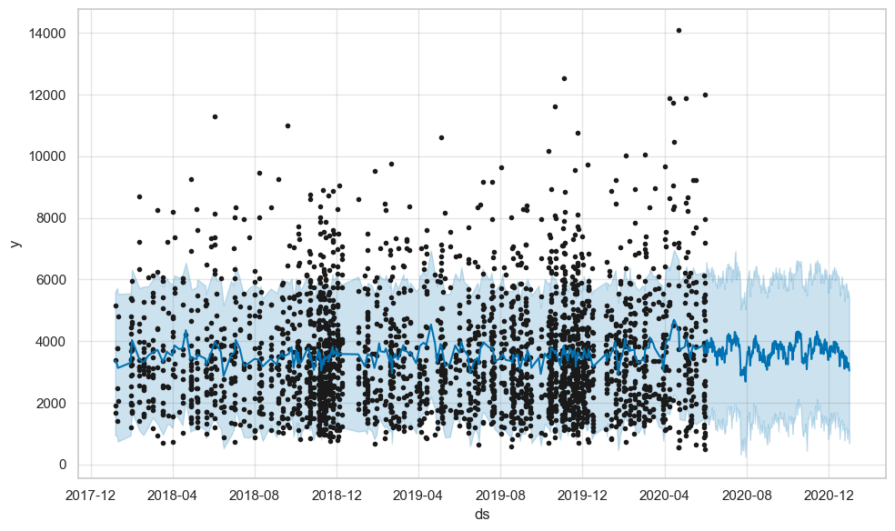
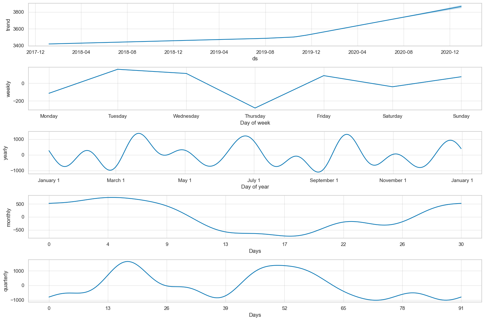

# Automobile Sales Analysis

  

1. [Overview](#overview)
2. [Methodology](#methodology)
3. [Exploratory Data Analysis](#exploratory-data-analysis)
4. [Results and Conclusion](#results-and-conclusion)
5. [Recommendations](#recommendations)
6. [Dashboards](#dashboards)

## Overview
This analysis delves into a range of automobile sales transactions, exploring details such as Order Number, Quantity Ordered, Price, Product Line, Customer Information, and more. By scrutinizing critical aspects like sales volume, deal sizes, customer demographics, and order specifics across various automobile models, our objective is to unearth valuable insights. This analysis endeavors to provide prospective buyers and stakeholders with a comprehensive understanding of automobile sales patterns, enabling informed decision-making. 

**Key Objectives**:
- Sales Transaction Insights: Examining key sales transaction details such as quantity ordered, pricing, and deal sizes to understand the sales landscape. 
- Product Line Performance: Evaluating the performance of various product lines across different deal sizes.
- Customer and Geographic Analysis: Assessing customer demographics and geographical trends influencing automobile sales.
- Potential Sales Forecasting: Utilizing historical sales data and identified trends to develop potential sales forecasts, aiding in strategic planning and decision-making for future sales initiatives.

## Methodology

### Data Source
The data used for this analysis is from [kaggle](https://www.kaggle.com/datasets/ddosad/auto-sales-data). The dataset contains information about various automobile sales transactions, including details such as Order Number, Quantity Ordered, Price, Order Line Number, Sales Amount, Order Date, Days Since Last Order, Status, Product Line, MSRP (Manufacturer's Suggested Retail Price), Product Code, Customer Details (Name, Contact Information, Address), Deal Size, etc. The only thing adjusted from the dataset is the column names which was originally all capatilized but I decided to turn them into sentence case.

### Data Dictionary
| Columns              | Data Type        | Description                                                                                          |
|----------------------|------------------|------------------------------------------------------------------------------------------------------|
| OrderNumber          | Integer | Unique identification number assigned to each order.                                                  |
| QuantityOrdered      | Integer          | Number of items ordered in each order.                                                                 |
| Price            | Numeric          | Price of each item in the order.                                                                      |
| OrderLineNumber      | Integer          | Line number of each item within an order.                                                              |
| Sales                | Numeric          | Total sales amount for each order, calculated by multiplying the quantity ordered by the price of each item.|
| OrderDate            | Date/Time        | Date on which the order was placed.                                                                   |
| DaysSinceLastOrder | Integer          | Number of days that have passed since the last order for each customer.                                |
| Status               | Categorical (String)| Status of the order (e.g., Shipped, In Process, Cancelled, etc.).                                      |
| ProductLine          | Categorical (String)| Categories specifying the product lines to which each item belongs.                                    |
| MSRP                 | Integer          | Suggested selling price provided by the manufacturer for each item.                                    |
| ProductCode          | String| Unique code assigned to each product.                                                               |
| CustomerName         | String           | Name of the customer who placed the order.                                                             |
| Phone                | String| Contact phone number for the customer.                                                                 |
| AddressLine         | String           | First line of the customer's address.                                                                  |
| City                 | String           | City where the customer is located.                                                                   |
| PostalCode           | String| Postal code or ZIP code associated with the customer's address.                                          |
| Country              | String           | Country where the customer is located.                                                                 |
| ContactLastName      | String           | Last name of the contact person associated with the customer.                                           |
| ContactFirstName     | String           | First name of the contact person associated with the customer.                                          |
| DealSize             | Categorical (String)| Size categories of the deal or order, categorized as "Small," "Medium," or "Large."                   |

### Data Cleaning and Preprocessing
Fortunately the data is already cleaned and there are no duplicates and missing values.

## Exploratory Data Analysis
The final dataset consisted of 2747 unique orders and 20 columns based on the data dictionary. A MySQL database was developed to store these data.

### Key Insights from EDA

### Sales Transaction Insights

#### 1. **Distribution of Quantity Ordered**
The most frequent number of orders is 34, with 111 records. Conversely, there was one  order in particular with a quantity amounting to 97 making it the highest quantity ordered, on the other hand the lowest quantity ordered is 6. The overall average for order quantity is 35.1.

#### 2. **Distribution of Price**
The overall average price stands at 101.1, ranging from a minimum price of 26.88 to a maximum price of 252.87.

#### 3. **Distribution of Order Line Number**
The most occurent order line number is 1 with 298 counts. Similarly a trend can be seen in which the as the order line number increases the fewer counts it gets. The average is 6.49, with a minimum value of 1 and a maximum value of 18.

#### 4. **Distribution of MSRP**
The average MSRP is 100.69, with the MSRP ranging from a minimum of 33 to a maximum of 214.

#### 5. **Distribution of Status**
The most occurent status is shipped with a total of 2541 counts.

#### 6. **Distribution of Product Line**
The distribution of product lines includes seven categories: Classic Cars (949 counts), Vintage Cars (579 counts), Motorcycles (313 counts), Planes (304 counts), Trucks and Buses (295 counts), Ships (230 counts), and Trains (77 counts).

#### 7. **Distribution of Deal Size**
The most prevalent deal size observed was Medium, constituting 49.1% of the distribution, followed by Small, which accounted for 45.4% of the shares. Lastly, Large deals made up 5.5% of the distribution.

#### 8. **Distribution of Sales**
Notably, the average sale price is observed to be 3553.05. The recorded sales range from a minimum of 482.13 to a maximum of 14082. There is one sale in particular that is valued at 14082 which serves as the highest sale recorded.

#### 9. **Distribution of Sales**

### Customer and Geographic Analysis:

#### 10. **Distribution of Countries**
The top three countries placing orders were the USA with 928 counts, followed by Spain with 342 counts, and France with 314 counts.

#### 11. **Distribution of Cities**
The cities with the highest order counts were Madrid, registering 304 orders, followed by San Rafael with 180 counts, and NYC with 152 counts.

#### 12. **Distribution of Customers**
The most frequent customer is Euro Shopping Channel with 259 transactions made followed by Mini Gifts Distributors Ltd. with 180 transactions made.

### Relationship Analysis

**Correlation Analysis**
- **Quantity Ordered and Sales**: This correlation implies a moderately positive relationship (0.553) between the quantity of products ordered and sales. As more products are ordered, sales tend to increase. Therefore, higher customer purchases result in greater revenue through sales.

- **Prices and Sales**: The correlation indicates a strong positive relationship (0.808) between product prices and sales. When prices are higher, sales tend to increase substantially. Thus, pricing plays a pivotal role in driving revenue.

- **Order Line Number**: There seems to be a negligible correlation with other variables except for a slight negative relationship (-0.057) with sales. There might be a connection between the order line number and certain unmeasured factors related to sales frequency.

- **Days Since Last Order**:  Overall, there appears to be weak connections with most variables, except for a moderate negative correlation (-0.334) with sales. Frequent customers may tend to purchase smaller quantities, but this relationship isn't robust.

- **MSRP and Price**: This correlation shows a robust positive relationship (0.778) between Manufacturer's Suggested Retail Price (MSRP) and the selling price. In most instances, the selling price aligns closely with the manufacturer's recommendations.

### Product Line Performance

#### **Sales Distribution according to Deal Size and Product Line**
- **Deal Size and Sales**: Large deals exhibit a tendency to yield higher sales compared to other deal sizes. This suggests that larger deals correspond to higher sales figures.

- **Product Line and Sales**: Across all product lines, there is a relatively uniform average in sales with classic cars having the highest average sales. Another observation that could be made is that among the product lines, vintage cars stand out, showcasing some of the highest sales figures.

### Best Selling Product Analysis
Overall, the best-performing product of all time appears to be Classic Cars in the medium deal size category. It holds the highest total sales and the greatest quantity of orders placed. The achievement of such numbers sales could be attributed to both the volume of orders and the pricing, including the Manufacturer's Suggested Retail Price (MSRP) of the product.

### Sales Over Time

#### **Sales Trend by Year**

  

For the yearly trend, it can be seen that the end of the year is the time when the highest sales are made.

#### **Sales Trend by Quarter**

  

For the quarterly trend, as seen in the yearly trend, this confirms that sales are highest at the end of the year.

#### **Sales Trend by Month**

  

For the monthly trend, this trend also follows the trend in which the highest sales made was from the end of the month in the year of 2019 followed closely by the previous year.

#### **Sales Trend by Day of Month**

  

For day of the month trend, it can be seen that near the middle of the month sales are at the highest.

#### **Sales Trend by Day of the Week**

  

For daily trend, it can be seen that sales are highest at Tuesdays and lowest at Thursdays.

### Sales Forecast

The last order made was on May 31, 2020. I will do a forecast until the end of the 2020. The forecasting tool I'll be using is Facebook's/meta's Prophet.

  

The black dots represent the actual data points. It can be obsereved that there are some data points concentrated in some order dates this is due to multiple orders being placed on the same date. As seen near at the end of 2020-04 data points stops at May 31, 2020 thus the subsequent value is the forecast made with a set upper and lower boundary.

#### **Seasonality**

  

The seasonality observed in each trend generated by the forecast aligns consistently with the patterns previously observed in the existing orders. 

## Results and Conclusion

### Sales Transaction Insights

**Quantity Ordered and Pricing**
- Quantity Distribution: The dataset predominantly consists of orders with 34 units (111 records), with a wide range between 97 units (highest) and 6 units (lowest). The average order quantity stands at 35.1 units.
- Pricing Analysis: Prices exhibit diversity, with an average of 101.1 units. The range spans from 26.88 to 252.87 units, showcasing varied pricing strategies.

**Order Line Number and MSRP**
- Order Line Number Frequency: Order line number 1 is most common (298 counts), indicating its prevalence. As the order line number increases, counts diminish, averaging at 6.49.
- MSRP Distribution: The Manufacturer's Suggested Retail Price (MSRP) shows an average of 100.69, ranging between 33 and 214 units.

**Status, Product Line, and Deal Size**
- Order Status Frequency: 'Shipped' status dominates with 2541 counts, implying the completion of the majority of orders.
- Product Line Diversity: The dataset encompasses seven product line categories, with Classic Cars leading at 949 counts, followed by Vintage Cars (579 counts).
- Deal Size Disparities: Medium deals constitute 49.1%, while Small and Large deals represent 45.4% and 5.5%, respectively.

**Sales, Countries, Cities, and Customers**
- Sales Insights: The average sales price records at 3553.05 units, ranging from 482.13 to 14082. Notably, Euro Shopping Channel leads with 259 transactions, followed by Mini Gifts Distributors Ltd. with 180 transactions.
- Geographic Patterns: The USA tops the list of countries with 928 counts, followed by Spain (342) and France (314). Madrid, San Rafael, and NYC register the highest order counts among cities.

### Relationship Analysis

**Correlation Findings**
- Quantity-Sales Relationship: A moderate positive correlation (0.553) suggests higher orders correlate with increased sales, indicating a direct relationship.
- Price-Sales Relationship: Strong positive correlation (0.808) reveals that higher prices lead to increased sales, underscoring the influence of pricing on revenue generation.
- Order Line and Days Since Last Order: Show negligible correlations, indicating fewer connections with other variables except for minimal impact on sales.
- MSRP and Price: Demonstrates a strong positive relationship (0.778), indicating prices align closely with manufacturer recommendations.

### Product Line Performance

**Sales and Product Lines**
- Deal Size and Sales Performance: Large deals drive higher sales, while Classic Cars showcase the highest average sales, signaling their strong market presence.
- Best-Selling Product Analysis: Classic Cars in the medium deal size category emerges as the top-performing product, attributing its success to both high sales volume and pricing strategy.

### Sales Trends Over Time

**Trend Analysis**
- Sales Patterns: Sales indicate a noticeable upward trend by year and quarter, especially in 2020, implying potential growth opportunities.
- Peak Sales Times: Sales peak mid-month and on Tuesdays, suggesting favorable times for promotions or marketing strategies.

### Sales Forecast and Seasonality

**Forecasting and Seasonal Trends**
- Sales Forecast: Utilizing Facebook's Prophet forecasts future sales until the end of 2020, providing predictive insights.
- Seasonal Observations: The observed seasonality aligns with previous trends, indicating consistent patterns in sales fluctuations.

**Conclusion**

The comprehensive exploratory analysis illuminates crucial aspects of automobile sales, encompassing quantity, pricing, product lines, geographical distribution, and sales trends over time. These insights equip stakeholders with valuable information for strategic planning, pricing strategies, and marketing efforts to optimize sales performance and market competitiveness.

## Recommendations

### Recommendations for Increasing Sales

**Pricing Strategy Refinement**:
- Dynamic Pricing Models: Implement dynamic pricing strategies based on the analysis of price and sales correlations. Utilize data to set competitive yet profitable pricing.
- Promotional Campaigns: Plan targeted promotional campaigns during peak sales periods, such as mid-month and Tuesdays, to capitalize on increased customer engagement.

**Product Line Optimization**:
- Focus on Best-Selling Products: Leverage the success of Classic Cars by further enhancing the marketing strategies and availability of this product.
- Diversification: Introduce variations or complementary products within the Classic Cars segment to cater to diverse customer preferences.

**Market Expansion and Customer Engagement**:
- Geographical Expansion: Consider expanding marketing efforts in countries like Spain and France, given their substantial order counts, to tap into potentially lucrative markets.
- Customer Engagement Programs: Develop loyalty programs or exclusive deals to retain high-transacting customers like Euro Shopping Channel and Mini Gifts Distributors Ltd.

### Strategies for Product Line Diversification

**New Product Introductions**:
- Market Research: Conduct market research to identify emerging trends or customer demands for potential new product lines.
- Diversified Offerings: Introduce new product lines or variants based on market demand, keeping in mind the success of existing product lines.

**Product Line Expansion within Successful Categories**:
- Classic Cars Enhancement: Expand the Classic Cars category by introducing new models or exclusive editions to capitalize on its high sales performance.
- Innovation within Vintage Cars: Enhance the Vintage Cars category with innovative models or features to attract diverse customer segments.

### Future Growth Strategies

**Forecast-Driven Planning**:
- Utilize Sales Forecasting: Leverage sales forecasting to plan inventory, marketing, and staffing to align with projected sales trends.

**Customer-Centric Approach**:
- Personalized Marketing: Implement personalized marketing strategies based on customer purchasing patterns and preferences to enhance customer engagement and retention.

**Continuous Monitoring and Adaptation**:
- Real-time Monitoring: Establish systems for real-time monitoring of sales trends, enabling swift adaptation to changing market dynamics.

## Dashboards
To be added...