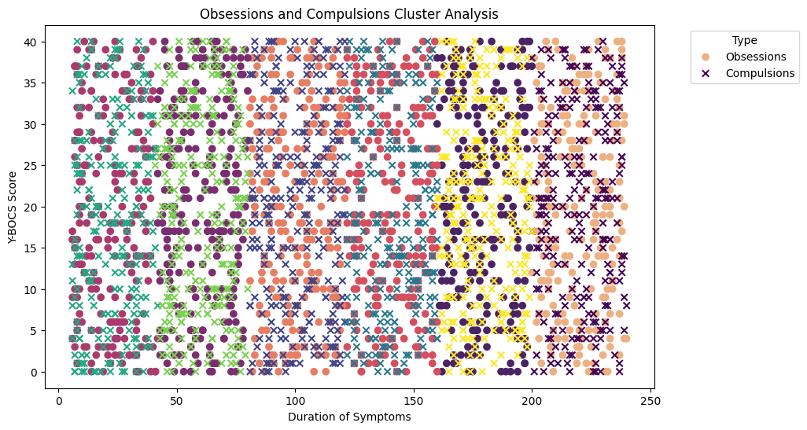
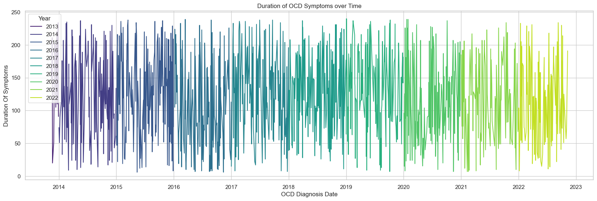

# Obsessive-Compulsive Disorder (OCD) Analysis

  

1. [Overview](#overview)
2. [Methodology](#methodology)
3. [Exploratory Data Analysis](#exploratory-data-analysis)
4. [Results and Conclusion](#results-and-conclusion)
5. [Recommendations](#recommendations)
6. [Dashboard](#dashboard)

## Overview
This analysis delves into the comprehensive data of Obsessive-Compulsive Disorder (OCD) patients, encompassing various patient-specific details such as demographics, clinical information, diagnosis history, symptomatology, and medication profiles. By scrutinizing critical aspects like patient characteristics, symptom severity, diagnosis history, and treatment approaches, the objective is to glean valuable insights into the landscape of OCD cases, aiding in a better understanding of the disorder and guiding treatment strategies. 

**Key Objectives**:
- Patient Profile and Demographics: Analyzing patient demographics including age, gender, ethnicity, marital status, and educational levels to identify potential correlations with OCD manifestation. 
-  Duration and Symptomatology: Examining the duration of symptoms, specific types of obsessions and compulsions, along with associated severity scores (Y-BOCS), and any comorbid mental health diagnoses such as depression and anxiety.
- Correlation Analysis: Exploring potential correlations between demographic factors, symptom types, severity scores, and treatment methods to understand patterns or associations within the OCD patient dataset.
- Diagnosis and Treatment Trends: Investigating the timeline of OCD diagnoses, previous diagnoses, family history correlations, and the usage of medications among patients.

## Methodology

### Data Source
The dataset used for this analysis contains information pertaining to Obsessive-Compulsive Disorder (OCD) patients came from [kaggle](https://www.kaggle.com/datasets/ohinhaque/ocd-patient-dataset-demographics-and-clinical-data) and encompasses a range of demographic and clinical data. It provides detailed insights into various attributes associated with individuals diagnosed with OCD.

### Data Dictionary
| Columns                   | Data Type       | Description                                                                                     |
|---------------------------|-----------------|-------------------------------------------------------------------------------------------------|
| Patient ID                | Integer         | Unique identification number assigned to each patient.                                           |
| Age                       | Integer         | Age of the patient at the time of diagnosis.                                                      |
| Gender                    | Categorical (String) | Gender identification of the patient.                                                         |
| Ethnicity                 | Categorical (String) | Ethnic background of the patient.                                                             |
| Marital Status            | Categorical (String) | Current marital status of the patient.                                                         |
| Education Level           | Categorical (String) | Highest educational qualification attained by the patient.                                       |
| OCD Diagnosis Date        | Date/Time       | Date when the patient was diagnosed with OCD.                                                    |
| Duration of Symptoms (months) | Integer    | Duration in months between the diagnosis date and onset of symptoms.                               |
| Previous Diagnoses        | Categorical (String) | Any pre-existing diagnoses before the OCD diagnosis.                                            |
| Family History of OCD     | Categorical (String) | Information about a family history of OCD in the patient's relatives.                             |
| Obsession Type            | Categorical (String) | The category/type of obsessions experienced by the patient.                                      |
| Compulsion Type           | Categorical (String) | The category/type of compulsions observed in the patient.                                         |
| Y-BOCS Score (Obsessions) | Integer         | Severity score related to obsessions based on the Yale-Brown Obsessive-Compulsive Scale.          |
| Y-BOCS Score (Compulsions) | Integer       | Severity score related to compulsions based on the Yale-Brown Obsessive-Compulsive Scale.         |
| Depression Diagnosis      | Categorical (String) | Whether the patient has been diagnosed with depression.                                           |
| Anxiety Diagnosis         | Categorical (String) | Whether the patient has been diagnosed with anxiety.                                              |
| Medications               | Categorical (String) | Information about medications prescribed or taken by the patient.                                  |

### Data Cleaning and Preprocessing
Fortunately the data is already cleaned and there are no duplicates and missing values.

## Exploratory Data Analysis
The final dataset consisted of 1500 rows of patient data and 17 columns based on the data dictionary. A MySQL database was developed to store these data.

### Key Insights from EDA

### Patient Profile and Demographics

#### 1. **Distribution According to Gender**
The distribution is fairly balanced between females and males, with a distribution of 49.8% for Females and 50.2% for Males.

#### 2. **Distribution According to Ethnicity**
The distribution slightly varies but is relatively evenly spread across different ethnic groups, with a distribution of 21.6% African, 26.13 Hispanic, 25.73% Asian, and 26.53% Caucasian.

#### 3. **Distribution According to Marital Status**
The distribution is reasonably balanced among divorced, married, and single individuals, with a distribution of 32.13% divorced, 34.07% single, and 33.8% married.

#### 4. **Distribution According to Education Level**
The distribution is quite evenly distributed among different education levels, with a distribution of 24.4% with a college degree, 26.27 with some college education, 25.07% with a graduate degree, and 24.27% with high school education.

#### 5. **Distribution According to Previous Diagnoses**
The distribution is somewhat balanced across various diagnoses, with a distribution of 19.87% GAD, 20.87% panic disorder, 19.73% PTSD, 23% MDD, and 16.53% none.

#### 6. **Distribution According to Family History of OCD**
The distribution is almost an equal split between those with and without a family history of OCD, with a distribution of 49.33% with no family history of OCD and 50.67% with a family history of OCD.

#### 7. **Distribution According to Obsession and Compulsion Types**
The distribution varies, with slightly different counts among different types but no significantly dominant type. The distribution of obsession types is 20.4% contamination, 18.67% symmetry, 20.2% religious, 18.53% hoarding, and 22.2% harm-related. As for the distribution for compulsion types, 19.47% are checking, 21.4% are washing, 19.07% are praying, 19% are ordering, and 21.07% are counting.

#### 8. **Distribution According to Depression and Anxiety Diagnosis**
The distribution is moderately balanced between those diagnosed and not diagnosed, with a distribution of depression diagnoses with 48.53% not diagnosed with depression and 51.47% diagnosed with depression. As for the distribution of anxiety diagnoses, 49.93% are not diagnosed with anxiety, and 50.07% are diagnosed with depression.

#### 9. **Distribution According to Medications**
The distribution is relatively balanced among the different medication categories, with a distribution of 25.73% benzodiazepine, 23.47% SSRI, 25.07% SNRI, and 25.73% none.

### Duration and Symptomatology

**Obsession and Compulsion Factor**

Regarding specific types of obsessions and compulsions, the dataset displays a diverse range of manifestations. Obsession types, outlined in the "Obsession Type" column, and compulsion types, specified in the "Compulsion Type" column, demonstrate a relatively even spread across various categories. There isn't a dominant type, suggesting a diverse spectrum of obsessive and compulsive behaviors among patients diagnosed with OCD.

Moreover, the associated severity scores measured by the Yale-Brown Obsessive-Compulsive Scale (Y-BOCS) for both obsessions and compulsions exhibit comparable averages. The Y-BOCS scores for obsessions and compulsions among patients are relatively close in terms of their mean values, indicating a balance in the severity levels between these two aspects of OCD symptoms.

**Anxiety and Depression Factor**

Patients diagnosed with comorbid mental health conditions such as anxiety and depression showcase relatively similar frequencies within the dataset. There isn't a significant skew towards one condition over the other, suggesting a comparable prevalence of anxiety and depression diagnoses among individuals diagnosed with OCD.

### Relationship Analysis

**Correlation Analysis**

- **Age and Duration Of Symptoms**: Both variables show very weak correlations. The correlation coefficient between Age and Duration Of Symptoms is close to zero, indicating an almost negligible linear relationship between these variables.

- **Duration Of Symptoms and YBOCS Score Obsessions / YBOCS Score Compulsions**: There seems to be a very weak positive correlation between Duration Of Symptoms and YBOCS Score Obsessions as well as Duration Of Symptoms and YBOCS Score Compulsions. These correlations are still quite low, indicating a weak linear relationship between the duration of symptoms and the severity scores of obsessions and compulsions.

- **YBOCS Score Obsessions and YBOCS Score Compulsions**: There is also a weak positive correlation between YBOCSScoreObsessions and YBOCSScoreCompulsions, suggesting a slight tendency for higher obsession scores to be associated with higher compulsion scores, but the correlation is not strong.

**Comparative Analysis**

Based on Obsession and Compulsion Types:

Obsession Type

- Harm-related obsession types are the most prevalent among both females (169 counts) and males (164 counts).
- Symmetry shows the lowest count among all obsession types in females, with 138 occurrences. Hoarding exhibits the lowest count among all obsession types in males, with 134 instances.
- Asians demonstrate the highest counts in Harm-related obsessions (95), followed by Religious (78).
- Caucasians lead in Contamination (89), Symmetry (79), and Hoarding (65) obsessions.
- Single patients show higher counts in Contamination (123), while divorced patients exhibit more harm-related obsession types (108).
- College Degree holders exhibit higher counts in Hoarding (82), while Graduate Degree holders demonstrate higher counts in Symmetry (83).
- Generalized Anxiety Disorder (GAD) patients have the highest counts in Harm-related (66) obsessions.

Compulsion Type

- Washing compulsion type has the highest count among females (161 instances), while Counting shows the highest count among males (176 instances).
- Counting exhibits the lowest count among all compulsion types for females (140 instances). Praying demonstrates the lowest count among all compulsion types for males (137 instances).
- Hispanics exhibit the highest counts in Washing (90) and Counting (88) compulsions.
- Caucasians lead in Checking compulsions (86).
- Divorced patients show higher counts in Washing (108), while single patients exhibit more Counting compulsion types (118).
- College Degree holders demonstrate higher counts in Washing (79), while Graduate Degree holders show higher counts in Counting (79) compulsions.
- Patients diagnosed with Major Depressive Disorder (MDD) show the highest counts in Washing (84) compulsions.

Based on Duration of Symptoms

The analysis of the "Duration and Symptomatology" section reveals a fairly distributed pattern across various attributes. The duration of symptoms, denoted by the "Duration of Symptoms (months)" column, showcases a relatively dispersed distribution among patients, indicating varying lengths of time between the onset of symptoms.

### Diagnosis and Treatment Trends

#### Cluster Analysis

  

There seems to be no cluster group or tight grouping being formed forming that data is randomly distributed or the features used for clustering might not effectively differentiate distinct groups. This is the same case if the Age is used.

### Time Series Analysis

  

The duration of OCD symptoms does not exhibit any discernible pattern or cyclic behavior concerning time. This observation suggests that the duration of symptoms remains relatively consistent or unpredictable across different time periods, showing no apparent trend or seasonal variation.

## Results and Conclusion

### Patient Profile and Demographics Analysis

- The dataset displays a fairly balanced distribution across gender, ethnicity, marital status, education level, previous diagnoses, family history of OCD, obsession and compulsion types, depression and anxiety diagnoses, and medication categories. This balance indicates a diverse representation of various demographic and clinical attributes within the OCD patient population.

### Duration and Symptomatology Analysis

- The data pertaining to obsession and compulsion types demonstrates a wide-ranging manifestation without a predominant type, indicating a diverse spectrum of obsessive and compulsive behaviors among patients with OCD.

- Severity scores measured by Y-BOCS for obsessions and compulsions exhibit comparable averages, signifying a balance in the severity levels between these two aspects of OCD symptoms.

### Anxiety and Depression Factor

- Patients diagnosed with comorbid mental health conditions such as anxiety and depression showcase relatively similar frequencies within the dataset, suggesting a comparable prevalence of these conditions among individuals diagnosed with OCD.

### Relationship Analysis

- Correlation analyses between age, duration of symptoms, and severity scores of obsessions and compulsions demonstrate weak relationships. There is a negligible linear relationship between age and symptom duration, and a weak positive correlation between symptom duration and severity scores, indicating limited impact of age on symptom duration and severity.

### Cluster and Time Series Analysis

- Cluster analysis does not reveal distinct groupings among the data attributes, suggesting a lack of clear differentiation among patient groups based on the features considered.
- Time series analysis of OCD symptom duration displays no discernible pattern or cyclic behavior over time, indicating consistency or unpredictability in symptom duration across different time periods.

### Correlation and Causation

The presence of correlation between certain factors in the dataset doesn't necessarily imply a cause-and-effect relationship for Obsessive-Compulsive Disorder (OCD). Correlation indicates statistical associations or relationships between variables, but it doesn't establish causation.

In the context of OCD and the dataset presented:

- Correlation: The analysis may have shown weak correlations between certain variables like age, duration of symptoms, and severity scores. For instance, weak correlations between age and symptom duration or severity scores might exist but these correlations don't signify a causal link.
- Causation in OCD: Determining the cause of OCD is complex. While certain factors might show associations with OCD (correlation), establishing causation requires extensive research, controlled studies, and in-depth analysis considering numerous factors such as genetic predispositions, environmental triggers, neurobiology, and individual psychology.

For instance:

- A weak correlation between age and symptom duration doesn't imply that aging directly causes longer OCD symptom duration.
- Similarly, weak correlations between certain obsessions/compulsions and demographics don't imply that these factors directly cause or lead to the development of OCD.

Causation in mental health disorders like OCD often involves multifaceted interactions among various biological, psychological, and environmental factors. While correlations can provide insights, establishing causation requires rigorous scientific investigations and controlled studies that specifically delineate cause-and-effect relationships.

**Conclusion**

This comprehensive analysis of OCD patient data highlights a diverse representation of demographics, symptomatology, severity scores, comorbid mental health conditions, and treatment aspects. The dataset demonstrates a lack of dominant patterns or correlations between certain demographic or clinical attributes and the duration/severity of OCD symptoms. The findings underscore the multifaceted nature of OCD, suggesting that the manifestation, severity, and treatment of the disorder may vary widely among individuals, highlighting the importance of personalized and nuanced approaches in managing OCD.

In the context of OCD, a wider spread or variability in these metrics may not inherently be categorized as good or bad. Instead, **it reflects the diversity and complexity of OCD experiences among individuals**. Treatment strategies and interventions may need to be tailored to accommodate this variability, ensuring personalized and effective approaches for managing symptoms based on individual needs. 

## Recommendations

### Recommendations for Increasing Sales

- **Personalized Treatment Plans**: Tailor treatment approaches for OCD patients, considering the diverse spectrum of symptomatology and severity observed across obsession and compulsion types.

- **Comprehensive Screening**: Conduct thorough screenings for comorbid mental health conditions like anxiety and depression, given their prevalent association with OCD. This ensures a holistic approach to patient care.

- **Continuous Monitoring**: Regularly monitor symptom duration and severity to assess the progression of OCD symptoms and their potential impact on the patient's well-being.

- **Research Focus**: Encourage further research into the nuanced relationship between demographic factors, symptomatology, and treatment outcomes in OCD. This can provide deeper insights for more effective interventions.

- **Patient-Centric Care**: Emphasize patient-centric care, acknowledging the unique experiences and presentations of OCD among individuals, promoting tailored treatment strategies.

- **Education and Awareness**: Promote awareness campaigns to reduce stigma around OCD, fostering understanding and support for affected individuals and their families.

- **Interdisciplinary Approach**: Foster collaboration between mental health professionals, researchers, and clinicians to explore innovative and integrated approaches in managing OCD.

- **Data Collection Enhancement**: Encourage enhanced data collection methodologies to gather more nuanced and detailed information about OCD presentations and treatment responses for improved analysis and decision-making.

## Dashboard

  

